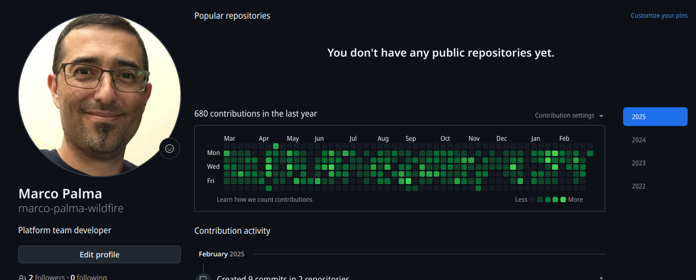
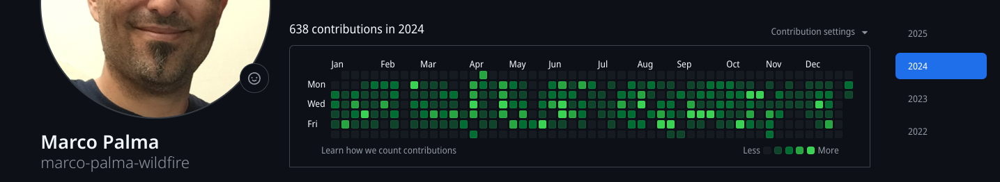
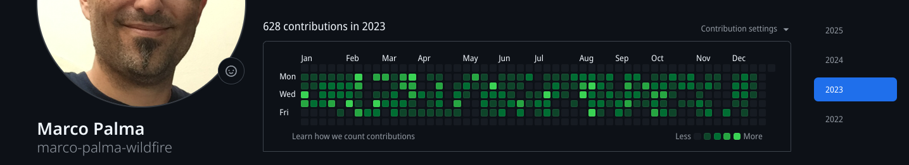
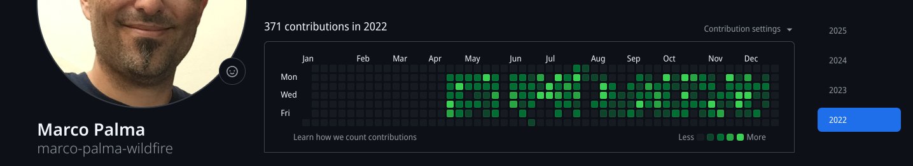

# Marco Palma's GitHub code contribution graphs while at WildFire

It's a shame that I can't go into much detail about what I actually implemented in the 3 years and 9 months that I spent at WildFire, but at least I had the forethought to take screen captures of my GitHub contributions graphs.

You can be sure that these weren't just a bunch of documentation and comments slapped into existing files.

That being said good documentation specially about how business logic is implemented is truly worth its weight in gold and sadly I didn't take snapshots about all the new docs I did publish to the wiki-like system we used there.

It's interesting to see that my average was around 600 contributions per year.

Given that there's ~260 working days a year, that works out to an average of 2.30 contributations per workday.

According to Google, [GitHub](https://docs.github.com/en/account-and-profile/reference/profile-contributions-reference)

    Key activities that count as contributions:
    **Commits:** Pushing commits to a repository's default branch (e.g., main or master) or gh-pages branch. The email address used for the commit must be linked to your GitHub account for it to be counted.
    **Pull Requests:** Opening a pull request or having a pull request you opened merged.
    **Pull Request Reviews:** Submitting a review on a pull request.

So PR reviews would seem to be a part of that and I do think one of my more important contributions at WF was making sure the code from the team kept flowing while at the same time not bringing down quality. 

As I got busy in 2025 I neglected to keep taking screen shots of my contribution graph, so the last this one at the top only covers January and February:

## 2025

The beginning part of 2025 involved paying down some tech debt, maintaining a lot of the already built systems, and making gradual improvements.  In my time at the company we easily doubled the number of code deployments. Half of them dealt with injesting data from partner APIs which meant that we need to respond often to external changes, often on short notice. 

The latter part of the year was a bit more fun as I began working on updates to various parts of Opensearch (an Apache-licensed fork of Elasticsearch) index updates and downstream consuming systems.

## 2024

A large part of 2024 was spent automating our partner billing system which previously lived as separate manual processes could take more than 24 hours to complete due to the volume of end user data that had to be processed.  The old way was problematic because it relied on humans to get all the steps executed correctly and to be able to maintain uninterrupted connections to production systems.

Obviously, this was less than optimal.  We managed to replace it with a new API wrapping the previous steps in several CRUD endpoints. Due to the execution running within the same network infrastructure as the database, the execution time was whittled down to 30 minutes.  More importantly, as a service, we now had proper logs and the rest of expected scaffolding that typical production systems are supposed to have.

## 2023

After a few months at WF, I noticed that our testing infrastructure was lacking when it came to the full life cycle of user transactions. I decided to go mildly rogue and put together a demo of how this could be done by using ephemeral databases.  Leveraging the database was a hard requirement because of the reliance on triggers which I did not want to simulate in mocks.

It helped that soon after I started developing this in my off hours, the company had sponsored hackathon which gave me the time to polish up the proof-of-concept.  As of the writing of this document, those resulting integration tests execute with every push to GitHub (thanks to the dedicated DevOps staff). This is probably what I'm proudest of all the things that I worked on while at WF.

It played an important role in proving Wildfire's industry leading approach to UDAAP compliance.

## 2022

My first year kicked off with a bang.  Initially I began tackling a backlog of tech debt resulting from the team having been so small for so long. Soon though I got my first greenfield project which was to build our offer translation system. This system ensured that we only presented offers with translation in all of a given country's official languages to end users, which was a legal requirement from a certain partner.

